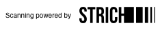
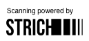
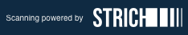
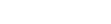

# STRICH Partner Link Package

Specification and assets for linking back to the STRICH website from partner pages.

We support light and dark backgrounds, as well as horizontal and vertical layouts.






## Logo assets

For light backgrounds, use asset `strich_light.svg`:


For dark backgrounds, use asset `strich_dark.svg`:



Tinting the logo with your primary brand color is allowed, in that case use SVG and change the fill color.

## Link data

URL: https://strich.io

Text: _Scanning powered by_, to the left (horizontal layout) or above (vertical layout) of the logo.

## Sample HTML/CSS

### Horizontal Layout

Horizontal layout, text to the left of logo, with gap and centered vertically.

```html
<div id="#strich-partner-link">
<a href="https://strich.io"></a>
</div>
```

```css
#strich-partner-link {
    display: flex;
    gap: 4px;
    align-items: center;
}
```

### Vertical Layout

Vertical layout with right-aligned edges (switch for left-aligned if you place it at the start of your footer).

```css
#strich-partner-link {
    display: flex;
    flex-direction: column;
    align-items: end;
    gap: 4px;
}
```
